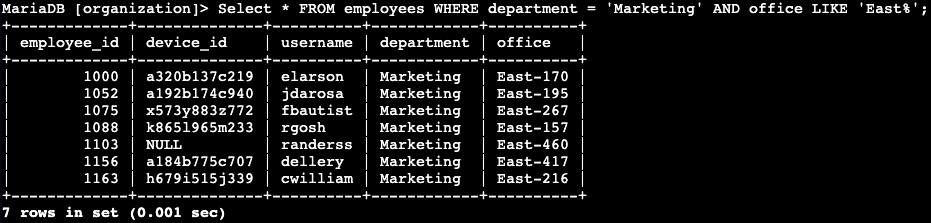

<h1>Applying filters to SQL Queries</h1>

<h2>Description</h2>
Project scenario:  
I recently discovered some potential security issues that involve login attempts and employee machines.
  
I will examine the organization’s data in our  DB (employees  and log_in_attempts tables) and will be using SQL filters to retrieve records from different datasets and investigate the potential security issues.
 
 

<h2> Retrieve after hours failed login attempts</h2>
Utilized the following query to search through all the columns in the <i>log_in_attemps</i> table, specifically for the login time after 6:00 PM <b><i>and</i></b> that were not successful:
  

<b><i>SELECT *  
FROM log_in_attempts  
WHERE login_time > '18:00:00' AND success = 0;</i><b>  
 
There were 19 failed login attempts that occurred after 18:00 (6:00 PM). 

<h2>Retrieve login attempts on specific dates</h2>
Utilized the following query to investigate the suspicious even that occurred on 5/9/22 <b><i>or</i></b> 5/8/22: 
  

<b><i>SELECT *  
FROM log_in_attempts  
WHERE login_date = ‘2022-05-09’ OR login_date = ‘2022-05-08’; </i></b>  
 
There were 75 login attempts, combined, on both days. 
 
 

<h2>Retrieve login attempts outside of Mexico</h2>
Utilized the following query to see all login attempts that occurred except for Mexico:
  

<b><i>SELECT *  
FROM log_in_attempts  
WHERE NOT country LIKE 'Mex%'; </i></b>  

Note: the query uses <b><i>NOT</i></b> to exclude the output of the country field for Mex/Mexico and <b><i>LIKE</i></b> was used for the contains % wildcard, as the entries in the table for Mexico were either Mex or Mexico which <b><i>LIKE ‘Mex%’</i></b> accounts for.
  
There were 144 login attempts outside of Mexico.
 
 

<h2>Retrieve employees in Marketing</h2>
Security updates need to be performed on employee machines in the Marketing department, specifically those in the East building. Utilized the following query:
  

<b><i>Select *  
FROM employees  
WHERE department = ‘Marketing’ AND office LIKE ‘East%’; </i></b> 
 
 
 

Note: <b><i>LIKE</i></b> was used for the contains <b><i>%</i></b> wildcard, as there were various East building numbers.
  
There are 7 employee machines that require updates. 
 
 

<h2>Retrieve employees in Finance or Sales</h2>
Security updates need to be performed on machines for employees in the Sales and Finance departments.  
Utilized the following query:
  

<b><i>SELECT *  
FROM employees  
WHERE department = ‘finance’ OR department =  ‘sales’; </i></b> 
 
There are 71 employee machines that require updates. 
 
 

<h2>Retrieve all employees not in IT</h2>
Updates are needed on all other department machines, other than Information Techonolgy machines. Utilized the following query:
  

<b><i>SELECT *  
FROM employees  
WHERE NOT department = ‘Information Technology’; </i></b> 

There are 161 employee machines that require updates. 
 
 

<h2>Summary</h2>
I recently investigated potential security issues that involved login attempts and employee machines using SQL queries listed above. 
 
I also examine the organization’s data to provide insight into which employees' machines needed updates using SQL queries listed above.
